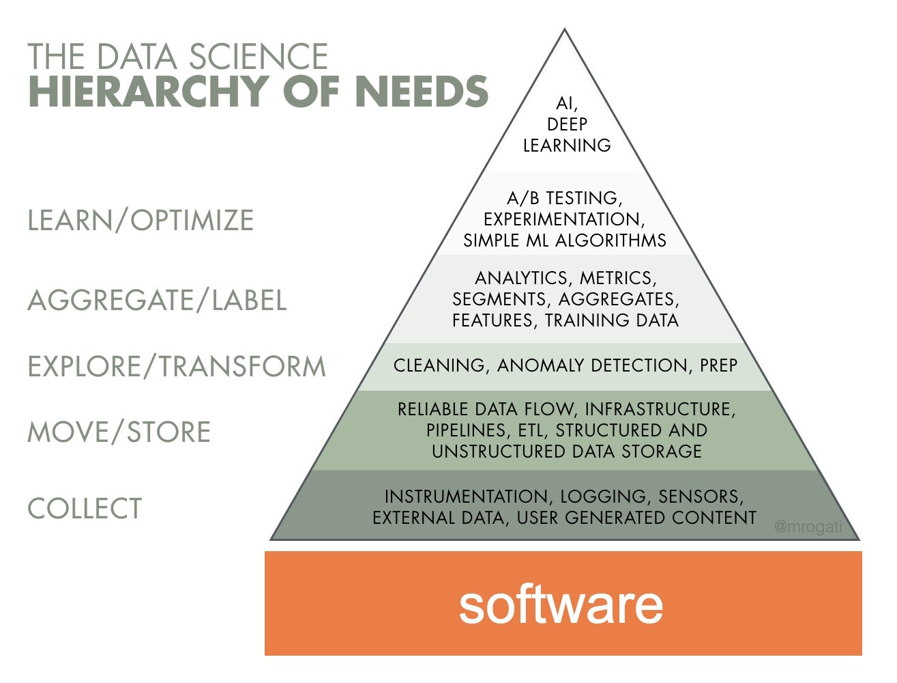
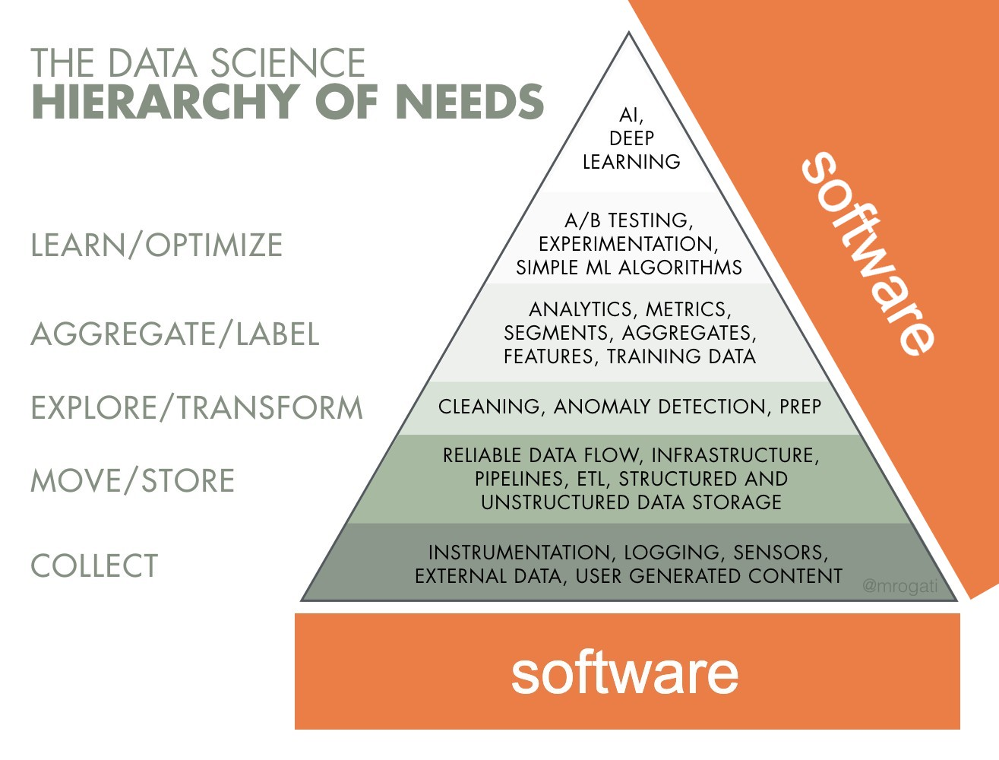
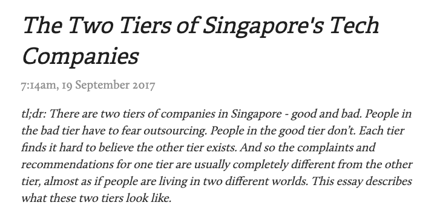

### my personal experience <br /> with software engineering hiring
ning yu


## 1
## motivation


software is important   
  
<small>https://hackernoon.com/the-ai-hierarchy-of-needs-18f111fcc00</small>


software lies below all that  



and beside that too  



software isn't homogenous  

but it's wrapped in elitism



<small><a href="http://elijames.org/the-two-tiers-of-singapores-tech-companies">http://elijames.org/the-two-tiers-of-singapores-tech-companies</a>

a lot of opinions here to consider - <a href="https://www.reddit.com/r/singapore/comments/i9d46m/two_tiers_of_tech_company_in_singapore/">recent reddit discussion</a>
</small>


### why does this happen?
because software engineering is hard  
you actually can't smoke this shit  


it's not just about X years of experience  
or how many degrees  
or what your job title is  

or what's your previous company  
(ok that actually does matter, just not 100%)  


you actually have to be good


## 2
## technical tests


some of the formats i've come across
- direct algo questions
- applied algo questions
- oop-ify something
- build a small app/api/feature

a common flow: algo -> wrap in oop -> wrap in API


mediums:
- take-home
- online 
- f2f
--- 
platforms: 
- IDE
- whiteboard
- google docs


\> whiteboarding is a terrible hiring practice

https://stackoverflow.blog/2019/12/16/this-this-whiteboard-interviews/  
(second half is satire)


my personal take
- don't see it as an excuse to not be good at technical tests
- not the sharpest tool, but still far more effective than looking at just CVs, degrees
- just a _*general name*_ for many different types of tests. some are more effective than others


what i did
- build my portfolio
- develop my skill as a software engineer
- know my MVCs and OOPs
- learn my algos!!!

first 2 points are what recruiters say  
last 2 points are focus of today


## 3
## examples


<iframe width="560" height="315" src="https://www.youtube.com/embed/IWvbPIYQPFM?start=318" frameborder="0" allow="accelerometer; autoplay; encrypted-media; gyroscope; picture-in-picture" allowfullscreen></iframe>


given a grid of size m by n  
find the maximum number of connected colour boxes


```go
let grid be m x n array of 0
let max_count be 0
for column in m {
    for box in n {
        if grid[column][box] is 0 {
            set grid[column][box] to 1
            run dfs_by_colour on grid[column][box]
            if size is greater than max_count {
                set max_count to size
            }
        }
    }
}
 
```

```go
function dfs_by_colour {
    a basic depth (or breadth) first search to count
    set grid[][] value to 1 when it is traversed
}
```


<font color=red>Given a list of movies watched by users of your app, and a movie a new user just watched, recommend another movie for him to watch.</font>  


collaborative filtering?


start simple!

find all users who also watched this movie  
and just grab the most watched movie of all these users

this is a semi-simple sql query


<font color=red>Design an app to provide an API service. The app should be able to store users, movies, watches and make recommendations.</font>


generally, this could be an MVC app.


2 models: `user`, `movie`, linked by a foreign key.

---

2 controllers: 
- user (CRUD + watch methods)
- movie (only CRUD)  

---

basic routes, plus a watch API.

---

remember to write unit tests!


<font color=red>How would you improve the performance of the recommendation API?</font>


cache results when queried, set to expire in 24 hours.

any other ideas?


## 4
## preparation


data structures and algorithms


you don't need to implement them

but you'll need to know how to use them, and what's the big O for common operations
- insert
- remove
- find


basics: hashmap, array, _*recursion*_, __oop__

linear: sorts, linkedlists, deque

nonlinear: graphs, trees, heaps


ways to study:
- CLRS
- take a MOOC algo class
- practice using them on leetcode


practical software engineering


pick a common framework or language
- ruby on rails
- express.js
- golang
- django (i guess)

and do a tutorial on it


build some apps, and learn to deploy!


final tips


- no one has asked me about docker, ever

- don't just learn the tool, learn the underlying concept

- engineering is always about making tradeoffs

- you're not expected to know everything. feel free to ask questions, and be honest about making mistakes.

- interviews are a great way to know better about the company
