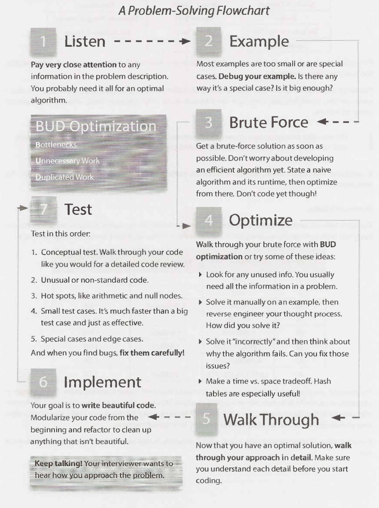
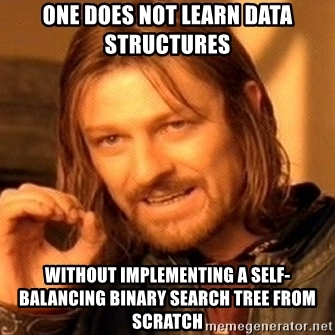
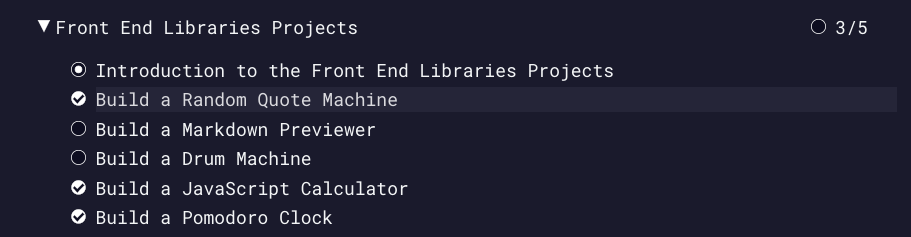
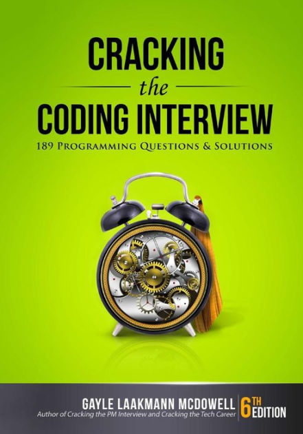

### my personal experience <br /> with software engineering hiring

slides can be found at: <a href="https://ningzy.me/tech-test">ningzy.me/tech-test</a>


#### note:
this sharing will be recorded at the request of people who could not make it today.

wenxian the secureai team would like to dedicate this slide to wai marn, wishing her speedy recovery from her wisdom teeth extraction happening right now as we speak.


# 1
# motivation
addressing some commonly heard things


## software engineering is
- "not important"
- "just outsource"
- "AI is the future, software is the past"


## the data science "hierarchy of needs"

<small>https://hackernoon.com/the-ai-hierarchy-of-needs-18f111fcc00</small>


mastery of software is necessary for good data science
### it's not a foregone conclusion


## software engineers are?
- "software developer no future one"
- "no code app development is the next big thing"
- "your company can just outsource to india/china"
- "software is so easy now, not worth your time"


the software industry isn't homogenous
### but wrapped in elitism
you can't just climb your way up like a typical career


<a href="http://elijames.org/the-two-tiers-of-singapores-tech-companies">http://elijames.org/the-two-tiers-of-singapores-tech-companies</a>

a lot of opinions here to consider - <a href="https://www.reddit.com/r/singapore/comments/i9d46m/two_tiers_of_tech_company_in_singapore/">recent reddit discussion</a>


## my subjective, unscientific take

| higher tier   || lower tier    |
| ------------- || ------------- |
| software is core || software is a means to sales |
| team owns the product || let's just get it done and over with |
| problems are unique, requires skill || just need some tom dick harry to implement |
| quality is highly valued || doesn't really matter, can run can liao |


| higher tier || lower tier |
| ------------- || ------------- |
| stringent technical assessment process || hiring is done by managers/HR |
| individual empowerment || corporatised |
| tries to move towards being agile || claims to be agile |


| higher tier || lower tier |
| ------------- || ------------- |
| pays pretty damn well || doesn't pay well* |
| values technical progression || encourages jump to management asap |
| you wanna be here || not here |

<br />

<small>\* not necessarily. i've heard sometimes companies pay well because the job sucks.</small>


why can't you "farm" into the good places

and if you can't climb your way into good software roles

how do you get in?


good software companies emphasize on __technical abilities__

### they develop assessments that assess your skill and potential


it's not about:
- X years of experience
- what / how many degrees
- what your job title is / was

sometimes it isn't even about your previous company
(though that actually does matter)


good software companies value
### what you value in a software engineer
- what have you build (and can show)
- what problems can you solve
- how good you are at coding
- how well you work with the team


# 2
# technical tests
some of my past experiences condensed


some of the formats i've come across
- direct algo questions
- applied algo questions
- converting something into OOP
- build a small app/API/feature

a common flow: develop an algo &#8594; wrap in OOP/API


## ways of execution
| mediums || platforms |
| ------------- || ------------- |
| take-home || google docs |
| online || whiteboard |
| in-person || IDE |


> whiteboarding is a terrible hiring practice

https://stackoverflow.blog/2019/12/16/this-this-whiteboard-interviews/
(second half is satire)


## my personal take
- not an excuse to not be good at technical tests
- not the sharpest tool, but still far more effective than looking at just CVs, degrees
- just a _*general name*_ for many different types of tests
- some whiteboard styles are very effective


## now for some examples!


### Our best friend Patrick Shyu (TechLead)
<iframe width="840" height="473" src="https://www.youtube.com/embed/IWvbPIYQPFM?start=318" frameborder="0" allow="accelerometer; autoplay; encrypted-media; gyroscope; picture-in-picture" allowfullscreen></iframe>


Given a 2d grid, find the maximum number of connected colour boxes. In the example, the answer would be 5 (bottom right, 5 connected boxes).


## tldr solution:
1. nested for loop to go through every cell
2. run __depth first search__ to find area on all untouched cells, marking them when touched
3. get the maximum count of a single DFS run


```go
let grid be m x n array of 0
let max_count be 0
for column in m {
    for box in n {
        if grid[column][box] is 0 {
            size -> dfs_by_colour(column, box)
            if size > max_count {
                set max_count to size
            }
        }
    }
}

```

```go
function dfs_by_colour(col, box) {
    counter = 0
    grid[col][box] -> 1
    if grid[col+1][box] == 0 and same colour:
        counter += dfs_by_colour(col+1, box)
    { repeat for 3 other directions }
    return counter
}
```


<div style="height: 45vh"></div>

Cracking the Coding Interview by Gayle Laakmann McDowell


## Given a list of movies watched by users of your app, and a movie a guest just watched, recommend another movie for him to watch as a "coming up next".


recommendation engine...
...collaborative filtering?


nooo!!! try to start simple!

find all users who also watched this movie
and just grab the most watched movie of all these users


this is a semi-simple sql query

1. select all users which watched the movie in query
2. for each user, select the movies he/she watched
3. sum all these watches, and sort by count
4. return the first record


Design an app to provide an API service. The app should be able to store users, movies, watches and make recommendations.


2 models: `user`, `movie`, linked by a foreign key.

---

2 controllers:
- user (CRUD + watch methods)
- movie (only CRUD)

---

basic routes, plus a watch API.

---

remember to write unit tests!


How would you improve the performance of the recommendation API?


cache results when queried, set to expire in 24 hours.

any other ideas?


# 3
# preparation


1. data structures and algorithms
2. object-oriented programming
3. backend MVC
4. frontend


## data structures and algorithms


you don't need to implement them
but you should know:

- what they are
- how they work
- how to use them
- time complexities for common operations


common operations:
- insert
- remove
- find
- next/previous


algos to know:

- recursion and dynamic programming
- basics: hashmap, array
- linear: sorts, linkedlists, deque
- nonlinear: graphs, trees, heaps


ways to study:
- CLRS
- take a MOOC algo class
- practice using them on leetcode
<br />



## object-oriented programming


- classes and instances
- inheritance
- abstract classes
- generics
- private and public
- constructors, methods and attributes
- _*this / self*_


you'll want to know how OOP is implemented in your language of choice,
and what are its drawbacks! (especially dynamic languages)


fastest way to learn this: take a MOOC on SWE/OOP,
and then do some problem sets & build some apps

\+ also note design patterns

\+ functional programming is a bonus


fastest way to learn this:
pick a common server framework

- ruby on rails (warning: magic)
- node/express.js
- spring (good verbosity to learn basics)
- laravel (php if you're coming from wordpress)

---

I would recommend these books: [rails](https://railstutorial.org) [nodejs](https://www.manning.com/books/node-js-in-action-second-edition)


your framework may dictate where you would go.
choose something you enjoy coding in.
(i'm not so sure about this)

- banks: java (spring)
- govtech: a lot of rails evidently
- grab: golang


## frontend
(if you're interested only)


you'll have to know javascript to do this!!

pick a common frontend framework:

- react
- vuejs
- angular (?)

they're very similar, you don't have to be very deliberate about it


quickly do a tutorial and understand:
- lifecycle APIs
- component props/states & other APIs
- stores, routes, mixins, etc

then, build a few apps for fun,
to get used to thinking about designing apps and features.



<a href="https://www.freecodecamp.org/learn/front-end-libraries/front-end-libraries-projects/">FreeCodeCamp</a> is good shit imo


## resources and tips
that didn't fit anywhere else


https://visualgo.net

website built by NUS SoC to teach students algorithms.
we mug this before every algo exam.


https://www.leetcode.com

great website to do some algorithm practice questions and learn algorithmic thinking




world famous book on algos. has a lot of gems! every time i prep for interviews again, i go back and study this.


https://www.freecodecamp.org/learn

the datacamp of software engineering, but FOC.
i started my dev journey with this.


- no one has asked me about docker, ever. docker is not a big deal imo.

- don't just learn the tool, learn the underlying concept (e.g. event loops, declarative programming)

- engineering is always about making __tradeoffs__!!!!!

- you're not expected to know everything. feel free to ask questions, and be honest about making mistakes.

- interviews go both ways - it is also for you to assess about the company


### examples of bad experiences i've had

- a chat with the hiring manager, without any technical interviews

- uni-direction Q&A without any real discussion/feedback

- pure undergrad algorithm questions

- recruitment by HR only

- bad feedback from interviewers


### glhf
let's build some good shit together :)


